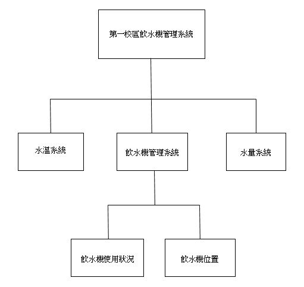

# 2020_OO_08
### 組長:顏志軒 C107118112 資管三甲
### 組員:江遠奇 C107118101
###      楊諺霖 C107118142
###      李佳明 C107118146
###      張閔淇 0624033
---
### 題目: 第一校區飲水機管理系統
#### 簡介: 偉哉學校偉大的飲水機三不五時都缺水，或是冰水卻是40度的溫水，
#### 因此我們想要製作一個可以知道全校飲水機狀況以及水溫的系統
#### 摘要:
---
### 組員分配工作:
#### 硬體設計：李佳明
#### 軟體設計：江遠奇
#### 前端UI設計：顏志軒
#### 測試人員：楊諺霖
#### 資料蒐集：張閔淇
---

#### 繪圖工具:hackMD
[PERT圖與甘特圖](https://hackmd.io/z_OxTWhSTg6-67fiiB-2-g)
---

### 功能的需求
#### 1.可以知道哪裡還有沒缺水的飲水機
#### 2.知道每台飲水機內部的水溫
#### 3.跟學校系統做連結，即時查詢飲水機位置
---

### 非功能性的需求
#### 1.反應時間:可以即時查詢飲水機位置
#### 2.效能:能夠隨時更新準確的水溫及水量
#### 3.使用性:校內師生都能輕鬆操作，並且每天都會用到
---

### FDD圖

---

### 需求分析文字描述
#### (1)系統管理者可以定期更新校內飲水機狀況，例如:新建飲水機
#### (2)使用者可以透過系統尋找離自己最近的飲水機
#### (3)透過水溫系統顯示出校內各飲水機的水溫
#### (4)水量系統可以提供使用者清楚查詢哪台還有水，避免裝到一半缺水
---

### 使用案例說明

